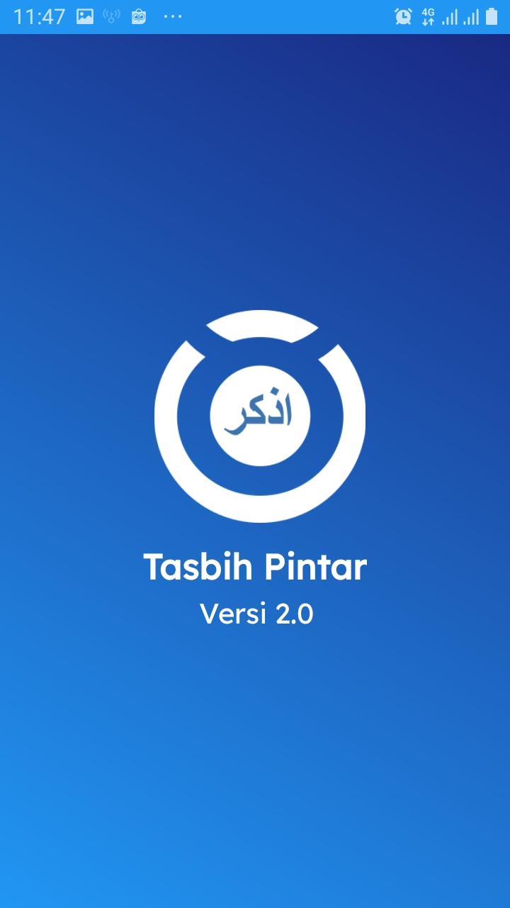
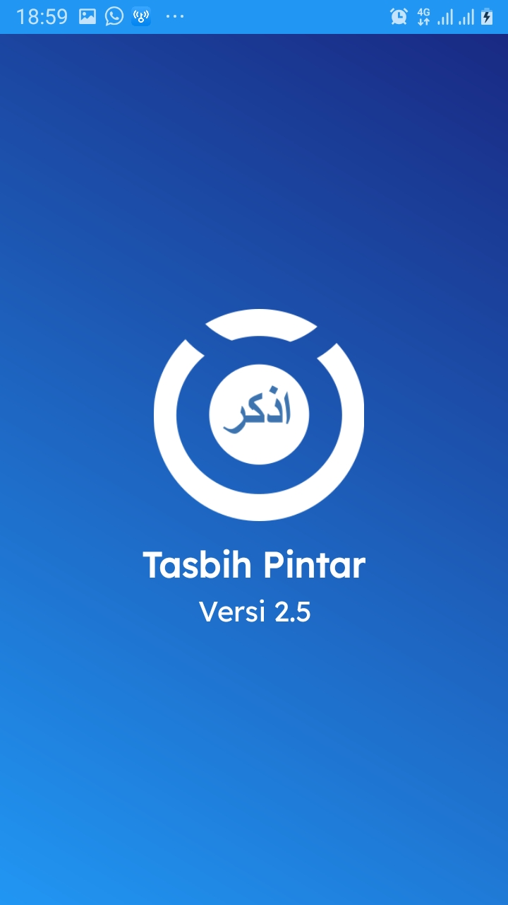
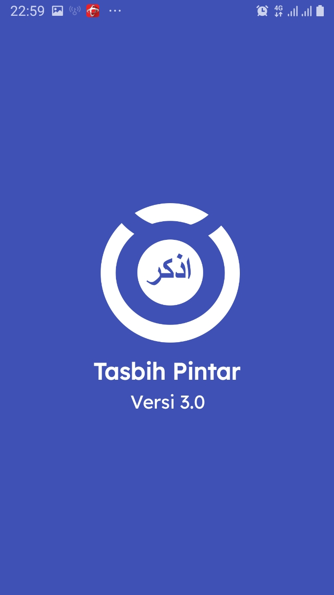
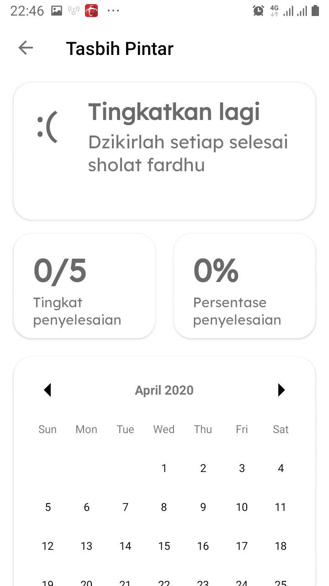
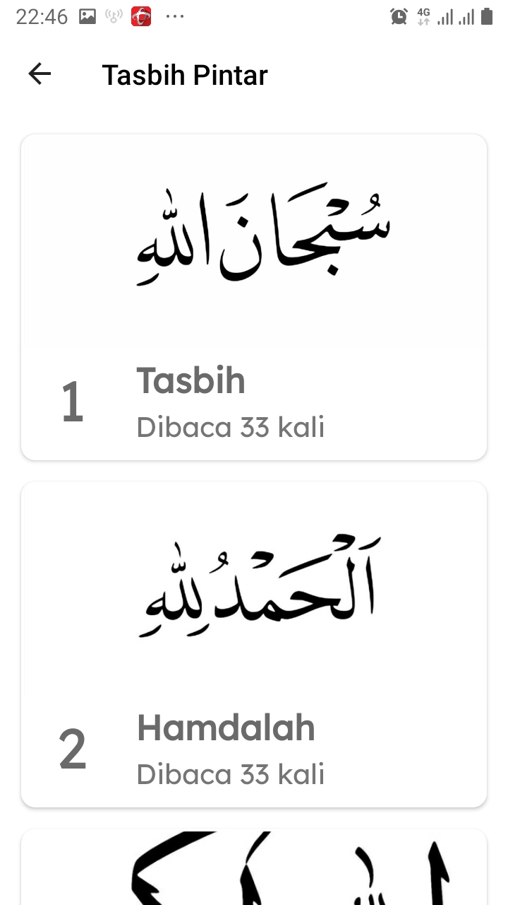

# Tasbih-Pintar
Tasbih Pintar adalah aplikasi berbasis Android yang dirancang untuk memudahkan umat muslim dalam beribadah terutama dzikir. 
Maka dengan adanya aplikasi ini, diharapkan mampu meningkatkan kualitas ibadah penggunanya agar bisa meningkatkan iman
dan taqwa selalu salah satunya dengan berdzikir. 

### Screenshots Aplikasi
#### V2.0
<table>
	<tr>
		<td>
			  
		</td>
	<td>
			
		</td>
	</tr>
</table>
 

#### V2.5
<table>
	<tr>
		<td>
			  
		</td>
		<td>
			
		</td>
		<td>
			  
		</td>
		<td>
			  
		</td>
	</tr>
</table>

#### V3.0
<table>
	<tr>
		<td>
			  
		</td>
		<td>
			  
		</td>
		<td>
			  
		</td>
		<td>
			  
		</td>
		<td>
			  
		</td>
	</tr>
</table>

